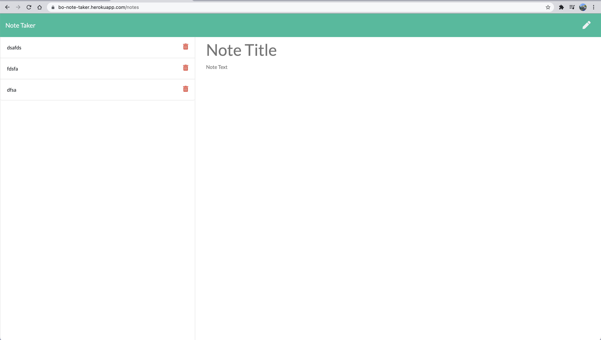

# Note-Taker

## Description
This app is used to write and save notes using express.
## Table Of Contents
* [Installation](#installation)
* [Usage](#Usage)
* [Credits](#Credits)
* [Contributing](#Contributing)
* [Tests](#Tests)
* [Questions](#Questions)
* [License](#license)
## Installation
It is deployed @ https://bonotetaker.herokuapp.com/
## Preview

## License
This is Licensed under the  license
## Usage
Write and save notes
## Credits

## Contributing

## Tests
none
## Questions
https://github.com/6bodaley6
  
